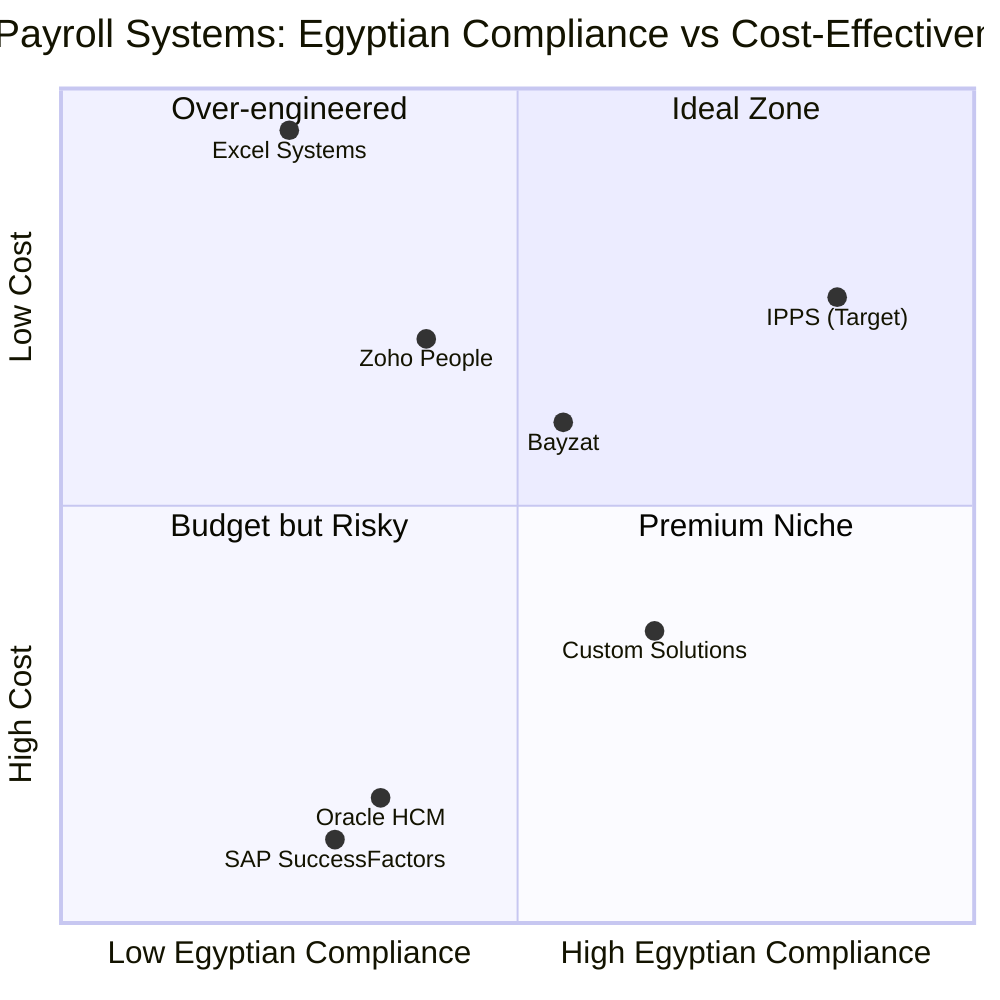
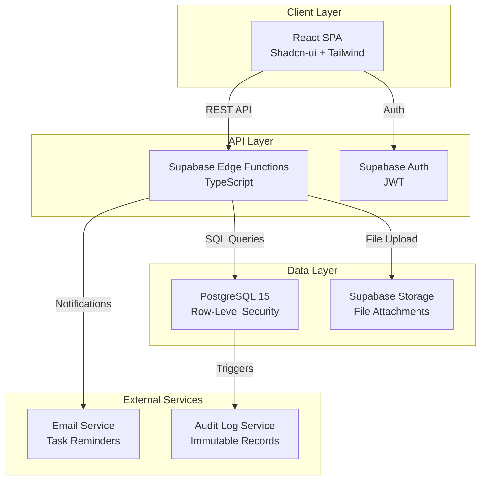

# IPPS - Integrated Personnel & Payroll System
## Product Requirements Document (PRD) & Software Requirements Specification (SRS)

---

## 1. Executive Summary

### 1.1 Project Overview
**Project Name:** ipps_egypt_hr_payroll  
**Programming Language:** TypeScript, Shadcn-ui, Tailwind CSS  
**Backend Service:** Supabase  
**Target Market:** Egyptian Organizations (Internal HR/Finance Operations)  
**Compliance Framework:** Egyptian Labor Law 12/2003, Social Insurance Law 148/2019, Income Tax Law 175/2023

### 1.2 Original Requirements
Replace Excel-based HR/Payroll processes with a compliant web portal focusing on:
- Employee retention and growth tracking
- Legal compliance with Egyptian labor regulations
- Automated payroll calculations (Social Insurance, Income Tax, Martyrs' Fund)
- Performance management with KPI-driven scoring
- Task assignment and productivity tracking
- Debt (Salfah) and penalty (Geza) management

---

## 2. Product Definition

### 2.1 Product Goals
1. **Legal Compliance Automation**: Eliminate manual calculation errors by automating Social Insurance (11% employee/18.75% employer), Income Tax (progressive brackets 0%-27.5%), and Martyrs' Fund (0.05%) deductions per Egyptian law
2. **Performance-Driven Retention**: Provide transparent KPI tracking with configurable weightages (e.g., Attendance 20%, Task Completion 80%) to enable data-driven bonus/disciplinary decisions
3. **Financial Transparency & Control**: Automate Salfah (debt) installment tracking with 50% net salary deduction cap enforcement, reducing payroll disputes by 90%

### 2.2 User Stories

#### Pillar 1: Performance & Feedback
**US1 (Manager - P0):**  
As a Manager, I want to fill out a manual performance form for my subordinates with weighted KPI scores so that I can justify annual bonuses or disciplinary actions with quantifiable data.

**US2 (Employee - P0):**  
As an Employee, I want to view my performance score breakdown (by KPI category) and read my manager's feedback so that I can understand my areas of improvement and career growth path.

**US3 (HR - P0):**  
As an HR Manager, I want to set different "Weightages" for KPIs (e.g., Attendance = 20%, Task Completion = 80%) per department so that the scoring reflects the nature of different roles (e.g., sales vs. operations).

#### Pillar 2: Task Assignment
**US4 (Manager - P0):**  
As a Manager, I want to assign tasks with a "Due Date" and priority level to my team so that I can track productivity digitally instead of via WhatsApp or paper, with automatic reminders 24 hours before deadline.

**US5 (Employee - P0):**  
As an Employee, I want to mark a task as "Completed" and upload proof (files/links up to 10MB) so that my performance score is automatically updated based on my output, reducing manual review time.

#### Pillar 3: Salaries & Debt (Egyptian Logic)
**US6 (HR/Finance - P0):**  
As an HR Admin, I want the system to automatically calculate Social Insurance (capped at 14,500 EGP, minimum 2,300 EGP) and Income Tax based on the latest Egyptian brackets so that we avoid legal fines and auditor penalties.

**US7 (Employee - P1):**  
As an Employee, I want to see my "Salfah" (Debt) balance, monthly installment amount, and remaining installments so that I can plan my monthly budget and request adjustments if needed.

**US8 (Finance - P0):**  
As a Finance Officer, I want the system to "Cap" total deductions at 50% of the net salary (after Social Insurance and Tax) to ensure we stay compliant with Egyptian Labor Law Article 67, preventing legal disputes.

### 2.3 Competitive Analysis

| Product | Pros | Cons | Target Market |
|---------|------|------|---------------|
| **Oracle HCM Cloud** | Enterprise-grade, multi-country compliance | Expensive (>$50k/year), complex setup, no Egyptian-specific Salfah logic | Large multinationals |
| **SAP SuccessFactors** | Strong performance management, global payroll | High cost, requires consultants, limited Arabic UI | Fortune 500 companies |
| **Zoho People** | Affordable ($2-5/user/month), easy setup | No Egyptian tax automation, manual Geza tracking | SMEs (50-200 employees) |
| **Bayzat (UAE-based)** | MENA-focused, Arabic support | UAE labor law focus, no Egyptian Social Insurance caps | Gulf region companies |
| **Excel-based Systems** | Free, flexible, familiar to users | Error-prone, no audit trail, manual calculations, no version control | Small businesses (<50 employees) |
| **Custom In-house Solutions** | Tailored to specific needs | High maintenance cost, lacks updates for law changes | Tech-savvy organizations |
| **IPPS (Our Product)** | Egyptian law automation, Salfah/Geza logic, audit trails, cost-effective | New product, limited integrations initially | Egyptian SMEs (50-500 employees) |

### 2.4 Competitive Quadrant Chart



---

## 3. Requirements Analysis

### 3.1 Functional Requirements

#### 3.1.1 Performance Management Module (P0)
- **FR-PM-001**: System MUST support configurable KPI weightages per department (sum = 100%)
- **FR-PM-002**: System MUST calculate weighted performance scores: `Score = Σ(KPI_i × Weight_i)`
- **FR-PM-003**: System MUST allow managers to add qualitative feedback (max 2000 characters) with mandatory employee acknowledgment
- **FR-PM-004**: System MUST generate performance history reports (quarterly/annual) with trend analysis

#### 3.1.2 Task Management Module (P0)
- **FR-TM-001**: System MUST support task assignment with fields: Title, Description, DueDate, Priority (High/Medium/Low), Weight (1-10)
- **FR-TM-002**: System MUST auto-update performance scores when task status changes to "Completed" based on: `Task_Score = (Weight × On_Time_Bonus) / Total_Assigned_Weight`
- **FR-TM-003**: System MUST send email reminders 24 hours before task deadline
- **FR-TM-004**: System MUST support file uploads (PDF, JPG, PNG, DOCX, max 10MB) as task completion proof

#### 3.1.3 Payroll Calculation Engine (P0)
- **FR-PC-001**: System MUST calculate Social Insurance based on:
  - Insurance Salary = CLAMP(BasicSalary, 2300, 14500)
  - Employee Contribution = Insurance Salary × 11%
  - Employer Contribution = Insurance Salary × 18.75%
- **FR-PC-002**: System MUST calculate Income Tax using progressive brackets:
  ```
  Taxable Income = Gross Annual Salary - 20,000 (Personal Exemption)
  Tax Brackets (2025):
  - 0 to 30,000: 0%
  - 30,001 to 45,000: 2.5%
  - 45,001 to 60,000: 10%
  - 60,001 to 200,000: 15%
  - 200,001 to 400,000: 20%
  - Above 400,000: 27.5%
  ```
- **FR-PC-003**: System MUST calculate Martyrs' Fund = Gross Salary × 0.05%
- **FR-PC-004**: System MUST enforce 50% deduction cap: `Total_Deductions ≤ (Gross - Social_Insurance - Tax) × 0.5`

#### 3.1.4 Debt Management (Salfah) (P0)
- **FR-DM-001**: System MUST allow HR to create Salfah records with: TotalAmount, MonthlyInstallment, StartDate
- **FR-DM-002**: System MUST auto-deduct installments from monthly payroll until RemainingAmount = 0
- **FR-DM-003**: System MUST prevent new Salfah creation if employee has an active debt (Status = "Active")
- **FR-DM-004**: System MUST adjust installment if it violates 50% deduction cap

#### 3.1.5 Penalty Management (Geza) (P1)
- **FR-PM-001**: System MUST support Geza entry with: DaysDeducted (max 5), Reason, MonthApplicable
- **FR-PM-002**: System MUST calculate penalty deduction: `Penalty = (BasicSalary / 30) × DaysDeducted`
- **FR-PM-003**: System MUST enforce 5-day Geza limit per month per Egyptian Labor Law

### 3.2 Non-Functional Requirements

#### 3.2.1 Performance (P0)
- **NFR-PERF-001**: Payroll calculation for 500 employees MUST complete within 30 seconds
- **NFR-PERF-002**: Dashboard load time MUST be < 2 seconds on 3G connection
- **NFR-PERF-003**: System MUST support 100 concurrent users without degradation

#### 3.2.2 Security (P0)
- **NFR-SEC-001**: System MUST implement Role-Based Access Control (RBAC) with roles: Employee, Manager, HR, Finance, Admin
- **NFR-SEC-002**: System MUST encrypt salary data at rest (AES-256) and in transit (TLS 1.3)
- **NFR-SEC-003**: System MUST log all salary changes with: UserID, Timestamp, OldValue, NewValue, Reason
- **NFR-SEC-004**: System MUST enforce data sovereignty: all salary data stored in Egyptian data centers (or Middle East region if Egypt unavailable)

#### 3.2.3 Auditability (P0)
- **NFR-AUD-001**: System MUST maintain immutable audit trail for all financial transactions (Salary_History table)
- **NFR-AUD-002**: System MUST generate audit reports showing "Who changed what, when, and why" for the last 7 years (Egyptian tax audit requirement)

#### 3.2.4 Localization (P0)
- **NFR-LOC-001**: System MUST support Arabic (RTL) and English (LTR) with runtime language switching
- **NFR-LOC-002**: System MUST display dates in Egyptian format (DD/MM/YYYY) and Hijri calendar option
- **NFR-LOC-003**: System MUST handle timezone conversion: Store all timestamps in UTC, display in GMT+2 (Egypt Standard Time) or GMT+3 (Egypt Daylight Time)

#### 3.2.5 Maintainability (P1)
- **NFR-MAIN-001**: Tax brackets MUST be stored in Tax_Config table (not hardcoded) to support annual updates
- **NFR-MAIN-002**: System MUST support database migration scripts for law changes (e.g., Social Insurance cap increase)

---

## 4. Technical Specifications

### 4.1 System Architecture

#### 4.1.1 Technology Stack
- **Frontend**: React 18+ with TypeScript, Shadcn-ui components, Tailwind CSS
- **Backend**: Supabase (PostgreSQL 15+, Row-Level Security, Edge Functions)
- **Authentication**: Supabase Auth with JWT tokens
- **File Storage**: Supabase Storage (for task attachments)
- **Deployment**: Vercel (frontend), Supabase Cloud (backend)

#### 4.1.2 Architecture Diagram


### 4.2 Database Schema

#### 4.2.1 Core Employee Tables

**Employees**
```sql
CREATE TABLE Employees (
    EmployeeID UUID PRIMARY KEY DEFAULT gen_random_uuid(),
    FullName VARCHAR(200) NOT NULL,
    FullNameArabic VARCHAR(200),
    NationalID VARCHAR(14) UNIQUE NOT NULL, -- Egyptian National ID
    Email VARCHAR(255) UNIQUE NOT NULL,
    PhoneNumber VARCHAR(15),
    JoiningDate DATE NOT NULL,
    PositionID UUID REFERENCES Positions(PositionID),
    DepartmentID UUID REFERENCES Departments(DepartmentID),
    ManagerID UUID REFERENCES Employees(EmployeeID),
    BasicSalary DECIMAL(10,2) NOT NULL CHECK (BasicSalary >= 0),
    InsuranceSalary DECIMAL(10,2) GENERATED ALWAYS AS (
        CASE 
            WHEN BasicSalary < 2300 THEN 2300
            WHEN BasicSalary > 14500 THEN 14500
            ELSE BasicSalary
        END
    ) STORED,
    Status VARCHAR(20) DEFAULT 'Active' CHECK (Status IN ('Active', 'Suspended', 'Terminated')),
    CreatedAt TIMESTAMP DEFAULT NOW(),
    UpdatedAt TIMESTAMP DEFAULT NOW()
);

CREATE INDEX idx_employees_manager ON Employees(ManagerID);
CREATE INDEX idx_employees_department ON Employees(DepartmentID);
```

**Departments**
```sql
CREATE TABLE Departments (
    DepartmentID UUID PRIMARY KEY DEFAULT gen_random_uuid(),
    DepartmentName VARCHAR(100) NOT NULL,
    DepartmentNameArabic VARCHAR(100),
    ManagerID UUID REFERENCES Employees(EmployeeID),
    CreatedAt TIMESTAMP DEFAULT NOW()
);
```

**Positions**
```sql
CREATE TABLE Positions (
    PositionID UUID PRIMARY KEY DEFAULT gen_random_uuid(),
    PositionTitle VARCHAR(100) NOT NULL,
    PositionTitleArabic VARCHAR(100),
    DepartmentID UUID REFERENCES Departments(DepartmentID),
    CreatedAt TIMESTAMP DEFAULT NOW()
);
```

#### 4.2.2 Performance & Tasks Tables

**KPI_Config**
```sql
CREATE TABLE KPI_Config (
    KPIID UUID PRIMARY KEY DEFAULT gen_random_uuid(),
    DepartmentID UUID REFERENCES Departments(DepartmentID),
    KPIName VARCHAR(100) NOT NULL, -- e.g., "Attendance", "Task Completion"
    KPINameArabic VARCHAR(100),
    Weightage DECIMAL(5,2) NOT NULL CHECK (Weightage >= 0 AND Weightage <= 100),
    IsActive BOOLEAN DEFAULT TRUE,
    CreatedAt TIMESTAMP DEFAULT NOW(),
    CONSTRAINT unique_kpi_per_dept UNIQUE (DepartmentID, KPIName)
);

-- Ensure total weightage per department = 100%
CREATE OR REPLACE FUNCTION check_kpi_weightage()
RETURNS TRIGGER AS $$
BEGIN
    IF (SELECT SUM(Weightage) FROM KPI_Config 
        WHERE DepartmentID = NEW.DepartmentID AND IsActive = TRUE) > 100 THEN
        RAISE EXCEPTION 'Total KPI weightage for department exceeds 100%%';
    END IF;
    RETURN NEW;
END;
$$ LANGUAGE plpgsql;

CREATE TRIGGER trg_check_kpi_weightage
AFTER INSERT OR UPDATE ON KPI_Config
FOR EACH ROW EXECUTE FUNCTION check_kpi_weightage();
```

**Tasks**
```sql
CREATE TABLE Tasks (
    TaskID UUID PRIMARY KEY DEFAULT gen_random_uuid(),
    AssignedTo UUID REFERENCES Employees(EmployeeID) NOT NULL,
    AssignedBy UUID REFERENCES Employees(EmployeeID) NOT NULL,
    Title VARCHAR(200) NOT NULL,
    Description TEXT,
    DueDate TIMESTAMP NOT NULL, -- Stored in UTC
    Priority VARCHAR(10) CHECK (Priority IN ('High', 'Medium', 'Low')) DEFAULT 'Medium',
    Status VARCHAR(20) DEFAULT 'Pending' CHECK (Status IN ('Pending', 'In Progress', 'Completed', 'Delayed', 'Cancelled')),
    Weight INT CHECK (Weight >= 1 AND Weight <= 10) DEFAULT 5,
    CompletedAt TIMESTAMP,
    ProofFileURL TEXT, -- Supabase Storage URL
    CreatedAt TIMESTAMP DEFAULT NOW(),
    UpdatedAt TIMESTAMP DEFAULT NOW()
);

CREATE INDEX idx_tasks_assigned_to ON Tasks(AssignedTo);
CREATE INDEX idx_tasks_status ON Tasks(Status);
CREATE INDEX idx_tasks_due_date ON Tasks(DueDate);
```

**PerformanceReviews**
```sql
CREATE TABLE PerformanceReviews (
    ReviewID UUID PRIMARY KEY DEFAULT gen_random_uuid(),
    EmployeeID UUID REFERENCES Employees(EmployeeID) NOT NULL,
    ReviewerID UUID REFERENCES Employees(EmployeeID) NOT NULL,
    ReviewPeriod VARCHAR(20) NOT NULL, -- e.g., "Q1 2025", "2025"
    ReviewType VARCHAR(20) CHECK (ReviewType IN ('Quarterly', 'Annual', 'Probation')) DEFAULT 'Quarterly',
    OverallScore DECIMAL(5,2) CHECK (OverallScore >= 0 AND OverallScore <= 100),
    ManagerComments TEXT,
    EmployeeAcknowledgment BOOLEAN DEFAULT FALSE,
    EmployeeComments TEXT,
    AcknowledgedAt TIMESTAMP,
    CreatedAt TIMESTAMP DEFAULT NOW(),
    CONSTRAINT unique_review_period UNIQUE (EmployeeID, ReviewPeriod)
);

CREATE INDEX idx_performance_employee ON PerformanceReviews(EmployeeID);
```

**PerformanceReview_KPIScores**
```sql
CREATE TABLE PerformanceReview_KPIScores (
    ScoreID UUID PRIMARY KEY DEFAULT gen_random_uuid(),
    ReviewID UUID REFERENCES PerformanceReviews(ReviewID) ON DELETE CASCADE,
    KPIID UUID REFERENCES KPI_Config(KPIID),
    Score DECIMAL(5,2) CHECK (Score >= 0 AND Score <= 100),
    Comments TEXT,
    CreatedAt TIMESTAMP DEFAULT NOW()
);
```

#### 4.2.3 Financial Tables (Egyptian Engine)

**Tax_Config**
```sql
CREATE TABLE Tax_Config (
    TaxBracketID UUID PRIMARY KEY DEFAULT gen_random_uuid(),
    EffectiveYear INT NOT NULL,
    BracketMin DECIMAL(12,2) NOT NULL,
    BracketMax DECIMAL(12,2),
    TaxRate DECIMAL(5,2) NOT NULL CHECK (TaxRate >= 0 AND TaxRate <= 100),
    PersonalExemption DECIMAL(12,2) DEFAULT 20000,
    CreatedAt TIMESTAMP DEFAULT NOW(),
    CONSTRAINT unique_tax_bracket UNIQUE (EffectiveYear, BracketMin)
);

-- Seed 2025 Tax Brackets
INSERT INTO Tax_Config (EffectiveYear, BracketMin, BracketMax, TaxRate, PersonalExemption) VALUES
(2025, 0, 30000, 0, 20000),
(2025, 30001, 45000, 2.5, 20000),
(2025, 45001, 60000, 10, 20000),
(2025, 60001, 200000, 15, 20000),
(2025, 200001, 400000, 20, 20000),
(2025, 400001, NULL, 27.5, 20000);
```

**SocialInsurance_Config**
```sql
CREATE TABLE SocialInsurance_Config (
    ConfigID UUID PRIMARY KEY DEFAULT gen_random_uuid(),
    EffectiveYear INT NOT NULL,
    MinInsuranceSalary DECIMAL(10,2) NOT NULL,
    MaxInsuranceSalary DECIMAL(10,2) NOT NULL,
    EmployeeRate DECIMAL(5,2) NOT NULL, -- 11%
    EmployerRate DECIMAL(5,2) NOT NULL, -- 18.75%
    CreatedAt TIMESTAMP DEFAULT NOW(),
    CONSTRAINT unique_insurance_year UNIQUE (EffectiveYear)
);

-- Seed 2025 Config
INSERT INTO SocialInsurance_Config (EffectiveYear, MinInsuranceSalary, MaxInsuranceSalary, EmployeeRate, EmployerRate)
VALUES (2025, 2300, 14500, 11, 18.75);
```

**Debts_Salfah**
```sql
CREATE TABLE Debts_Salfah (
    DebtID UUID PRIMARY KEY DEFAULT gen_random_uuid(),
    EmployeeID UUID REFERENCES Employees(EmployeeID) NOT NULL,
    TotalAmount DECIMAL(10,2) NOT NULL CHECK (TotalAmount > 0),
    RemainingAmount DECIMAL(10,2) NOT NULL CHECK (RemainingAmount >= 0),
    MonthlyInstallment DECIMAL(10,2) NOT NULL CHECK (MonthlyInstallment > 0),
    StartDate DATE NOT NULL,
    Status VARCHAR(20) DEFAULT 'Active' CHECK (Status IN ('Active', 'Settled', 'Cancelled')),
    Reason TEXT,
    ApprovedBy UUID REFERENCES Employees(EmployeeID),
    CreatedAt TIMESTAMP DEFAULT NOW(),
    SettledAt TIMESTAMP
);

CREATE INDEX idx_debts_employee ON Debts_Salfah(EmployeeID);
CREATE INDEX idx_debts_status ON Debts_Salfah(Status);

-- Constraint: Only one active debt per employee
CREATE UNIQUE INDEX idx_one_active_debt 
ON Debts_Salfah(EmployeeID) 
WHERE Status = 'Active';
```

**Penalties_Gezaat**
```sql
CREATE TABLE Penalties_Gezaat (
    PenaltyID UUID PRIMARY KEY DEFAULT gen_random_uuid(),
    EmployeeID UUID REFERENCES Employees(EmployeeID) NOT NULL,
    DaysDeducted INT NOT NULL CHECK (DaysDeducted >= 1 AND DaysDeducted <= 5),
    Reason TEXT NOT NULL,
    MonthApplicable DATE NOT NULL, -- First day of the month
    ApprovedBy UUID REFERENCES Employees(EmployeeID),
    CreatedAt TIMESTAMP DEFAULT NOW()
);

CREATE INDEX idx_penalties_employee ON Penalties_Gezaat(EmployeeID);
CREATE INDEX idx_penalties_month ON Penalties_Gezaat(MonthApplicable);
```

**Payroll_Slips**
```sql
CREATE TABLE Payroll_Slips (
    SlipID UUID PRIMARY KEY DEFAULT gen_random_uuid(),
    EmployeeID UUID REFERENCES Employees(EmployeeID) NOT NULL,
    Month INT CHECK (Month >= 1 AND Month <= 12) NOT NULL,
    Year INT NOT NULL,
    
    -- Earnings
    BasicSalary DECIMAL(10,2) NOT NULL,
    Allowances DECIMAL(10,2) DEFAULT 0,
    Overtime DECIMAL(10,2) DEFAULT 0,
    Bonus DECIMAL(10,2) DEFAULT 0,
    GrossSalary DECIMAL(10,2) GENERATED ALWAYS AS (BasicSalary + Allowances + Overtime + Bonus) STORED,
    
    -- Deductions
    SocialInsurance_Employee DECIMAL(10,2) NOT NULL,
    SocialInsurance_Employer DECIMAL(10,2) NOT NULL,
    IncomeTax DECIMAL(10,2) NOT NULL,
    MartyrsFund DECIMAL(10,2) GENERATED ALWAYS AS (GrossSalary * 0.0005) STORED,
    SalfahDeduction DECIMAL(10,2) DEFAULT 0,
    PenaltyDeduction DECIMAL(10,2) DEFAULT 0,
    OtherDeductions DECIMAL(10,2) DEFAULT 0,
    TotalDeductions DECIMAL(10,2) GENERATED ALWAYS AS (
        SocialInsurance_Employee + IncomeTax + MartyrsFund + 
        SalfahDeduction + PenaltyDeduction + OtherDeductions
    ) STORED,
    
    -- Net Salary
    NetSalary DECIMAL(10,2) GENERATED ALWAYS AS (GrossSalary - TotalDeductions) STORED,
    
    -- Metadata
    ProcessedBy UUID REFERENCES Employees(EmployeeID),
    ProcessedAt TIMESTAMP DEFAULT NOW(),
    Status VARCHAR(20) DEFAULT 'Draft' CHECK (Status IN ('Draft', 'Approved', 'Paid')),
    
    CONSTRAINT unique_payroll_month UNIQUE (EmployeeID, Month, Year)
);

CREATE INDEX idx_payroll_employee ON Payroll_Slips(EmployeeID);
CREATE INDEX idx_payroll_period ON Payroll_Slips(Year, Month);
```

**Salary_History (Audit Trail)**
```sql
CREATE TABLE Salary_History (
    HistoryID UUID PRIMARY KEY DEFAULT gen_random_uuid(),
    EmployeeID UUID REFERENCES Employees(EmployeeID) NOT NULL,
    ChangedBy UUID REFERENCES Employees(EmployeeID) NOT NULL,
    ChangeType VARCHAR(50) NOT NULL, -- e.g., "BasicSalary", "Allowance", "Position"
    OldValue TEXT,
    NewValue TEXT,
    Reason TEXT NOT NULL,
    EffectiveDate DATE NOT NULL,
    CreatedAt TIMESTAMP DEFAULT NOW()
);

CREATE INDEX idx_salary_history_employee ON Salary_History(EmployeeID);
CREATE INDEX idx_salary_history_date ON Salary_History(CreatedAt);

-- Trigger to log salary changes
CREATE OR REPLACE FUNCTION log_salary_change()
RETURNS TRIGGER AS $$
BEGIN
    IF OLD.BasicSalary != NEW.BasicSalary THEN
        INSERT INTO Salary_History (EmployeeID, ChangedBy, ChangeType, OldValue, NewValue, Reason, EffectiveDate)
        VALUES (NEW.EmployeeID, current_setting('app.current_user_id')::UUID, 'BasicSalary', 
                OLD.BasicSalary::TEXT, NEW.BasicSalary::TEXT, 'Salary adjustment', CURRENT_DATE);
    END IF;
    RETURN NEW;
END;
$$ LANGUAGE plpgsql;

CREATE TRIGGER trg_log_salary_change
AFTER UPDATE ON Employees
FOR EACH ROW EXECUTE FUNCTION log_salary_change();
```

### 4.3 API Design

#### 4.3.1 Authentication Endpoints
All endpoints require JWT token in Authorization header: `Bearer <token>`

**POST /auth/login**
```json
Request:
{
  "email": "user@example.com",
  "password": "SecurePass123!"
}

Response (200):
{
  "access_token": "eyJhbGciOiJIUzI1NiIsInR5cCI6IkpXVCJ9...",
  "refresh_token": "eyJhbGciOiJIUzI1NiIsInR5cCI6IkpXVCJ9...",
  "user": {
    "id": "uuid",
    "email": "user@example.com",
    "role": "Manager",
    "employee_id": "uuid"
  }
}
```

#### 4.3.2 Payroll Calculation Endpoint

**POST /api/payroll/calculate**

**Description:** Calculate monthly payroll for a single employee or batch of employees with all Egyptian law-compliant deductions.

**Request:**
```json
{
  "employee_ids": ["uuid1", "uuid2"],
  "month": 1,
  "year": 2025,
  "include_bonus": true,
  "bonus_amounts": {
    "uuid1": 500.00,
    "uuid2": 750.00
  }
}
```

**Response (200):**
```json
{
  "success": true,
  "payroll_slips": [
    {
      "slip_id": "uuid",
      "employee_id": "uuid1",
      "employee_name": "Ahmed Mohamed",
      "month": 1,
      "year": 2025,
      "earnings": {
        "basic_salary": 5000.00,
        "allowances": 500.00,
        "overtime": 200.00,
        "bonus": 500.00,
        "gross_salary": 6200.00
      },
      "deductions": {
        "social_insurance_employee": 550.00,
        "social_insurance_employer": 937.50,
        "income_tax": 125.00,
        "martyrs_fund": 3.10,
        "salfah_deduction": 300.00,
        "penalty_deduction": 166.67,
        "other_deductions": 0.00,
        "total_deductions": 1144.77
      },
      "net_salary": 5055.23,
      "deduction_cap_applied": false,
      "deduction_cap_limit": 3100.00
    }
  ],
  "summary": {
    "total_employees": 2,
    "total_gross": 12400.00,
    "total_net": 10110.46,
    "total_employer_cost": 14275.00
  }
}
```

**Calculation Logic (Pseudocode):**
```typescript
function calculatePayroll(employeeId: string, month: number, year: number) {
  // 1. Fetch employee data
  const employee = await db.employees.findById(employeeId);
  const insuranceConfig = await db.socialInsuranceConfig.findByYear(year);
  const taxConfig = await db.taxConfig.findByYear(year);
  
  // 2. Calculate earnings
  const grossSalary = employee.basicSalary + allowances + overtime + bonus;
  
  // 3. Calculate Social Insurance
  const insuranceSalary = clamp(employee.basicSalary, 
                                 insuranceConfig.minInsuranceSalary, 
                                 insuranceConfig.maxInsuranceSalary);
  const socialInsuranceEmployee = insuranceSalary * (insuranceConfig.employeeRate / 100);
  const socialInsuranceEmployer = insuranceSalary * (insuranceConfig.employerRate / 100);
  
  // 4. Calculate Income Tax (Annual then divide by 12)
  const annualGross = grossSalary * 12;
  const taxableIncome = annualGross - taxConfig.personalExemption;
  const annualTax = calculateProgressiveTax(taxableIncome, taxConfig.brackets);
  const monthlyTax = annualTax / 12;
  
  // 5. Calculate Martyrs' Fund
  const martyrsFund = grossSalary * 0.0005;
  
  // 6. Fetch Salfah and Geza
  const salfah = await db.debts.findActive(employeeId);
  const salfahDeduction = salfah ? salfah.monthlyInstallment : 0;
  
  const penalties = await db.penalties.findByMonth(employeeId, month, year);
  const penaltyDeduction = penalties.reduce((sum, p) => 
    sum + (employee.basicSalary / 30) * p.daysDeducted, 0);
  
  // 7. Calculate total deductions
  let totalDeductions = socialInsuranceEmployee + monthlyTax + martyrsFund + 
                        salfahDeduction + penaltyDeduction;
  
  // 8. Apply 50% deduction cap
  const netBeforeCap = grossSalary - socialInsuranceEmployee - monthlyTax;
  const deductionCapLimit = netBeforeCap * 0.5;
  const cappedDeductions = salfahDeduction + penaltyDeduction;
  
  if (cappedDeductions > deductionCapLimit) {
    // Adjust Salfah first, then penalties
    const adjustedSalfah = Math.min(salfahDeduction, deductionCapLimit);
    const adjustedPenalty = Math.min(penaltyDeduction, deductionCapLimit - adjustedSalfah);
    totalDeductions = socialInsuranceEmployee + monthlyTax + martyrsFund + 
                      adjustedSalfah + adjustedPenalty;
  }
  
  // 9. Calculate net salary
  const netSalary = grossSalary - totalDeductions;
  
  return {
    earnings: { grossSalary, ... },
    deductions: { totalDeductions, ... },
    netSalary
  };
}
```

**Error Responses:**
```json
400 Bad Request:
{
  "error": "INVALID_MONTH",
  "message": "Month must be between 1 and 12"
}

403 Forbidden:
{
  "error": "INSUFFICIENT_PERMISSIONS",
  "message": "Only HR and Finance roles can calculate payroll"
}

404 Not Found:
{
  "error": "EMPLOYEE_NOT_FOUND",
  "message": "Employee with ID uuid1 does not exist"
}
```

#### 4.3.3 Performance Sync Endpoint

**POST /api/performance/sync-tasks**

**Description:** Sync completed tasks to update employee performance scores based on configured KPI weightages.

**Request:**
```json
{
  "employee_id": "uuid",
  "review_period": "Q1 2025",
  "force_recalculate": false
}
```

**Response (200):**
```json
{
  "success": true,
  "employee_id": "uuid",
  "review_period": "Q1 2025",
  "kpi_scores": [
    {
      "kpi_name": "Task Completion",
      "weightage": 80,
      "raw_score": 85.5,
      "weighted_score": 68.4,
      "tasks_completed": 17,
      "tasks_total": 20,
      "on_time_percentage": 85
    },
    {
      "kpi_name": "Attendance",
      "weightage": 20,
      "raw_score": 95.0,
      "weighted_score": 19.0,
      "days_present": 57,
      "days_total": 60
    }
  ],
  "overall_score": 87.4,
  "updated_at": "2025-01-15T10:30:00Z"
}
```

**Calculation Logic:**
```typescript
function syncTasksToPerformance(employeeId: string, reviewPeriod: string) {
  // 1. Get KPI config for employee's department
  const employee = await db.employees.findById(employeeId);
  const kpiConfig = await db.kpiConfig.findByDepartment(employee.departmentId);
  
  // 2. Calculate Task Completion KPI
  const tasks = await db.tasks.findByEmployeeAndPeriod(employeeId, reviewPeriod);
  const completedTasks = tasks.filter(t => t.status === 'Completed');
  const onTimeTasks = completedTasks.filter(t => t.completedAt <= t.dueDate);
  
  const taskCompletionRate = (completedTasks.length / tasks.length) * 100;
  const onTimeRate = (onTimeTasks.length / completedTasks.length) * 100;
  const taskScore = (taskCompletionRate * 0.7) + (onTimeRate * 0.3); // Weighted
  
  // 3. Calculate weighted scores
  const kpiScores = kpiConfig.map(kpi => {
    let rawScore = 0;
    if (kpi.name === 'Task Completion') {
      rawScore = taskScore;
    } else if (kpi.name === 'Attendance') {
      rawScore = calculateAttendanceScore(employeeId, reviewPeriod);
    }
    return {
      kpiName: kpi.name,
      weightage: kpi.weightage,
      rawScore: rawScore,
      weightedScore: (rawScore * kpi.weightage) / 100
    };
  });
  
  // 4. Calculate overall score
  const overallScore = kpiScores.reduce((sum, kpi) => sum + kpi.weightedScore, 0);
  
  // 5. Update or create performance review
  await db.performanceReviews.upsert({
    employeeId,
    reviewPeriod,
    overallScore,
    kpiScores
  });
  
  return { overallScore, kpiScores };
}
```

#### 4.3.4 Additional Key Endpoints

**GET /api/employees/{id}/salfah**
- Returns active debt balance, installments, and payment history

**POST /api/tasks**
- Create new task with automatic reminder scheduling

**PATCH /api/tasks/{id}/complete**
- Mark task as completed, upload proof, trigger performance sync

**GET /api/payroll/audit-trail**
- Query salary change history with filters (employee, date range, change type)

**POST /api/reports/generate**
- Generate PDF reports (payroll summary, performance reports, audit logs)

### 4.4 Security Implementation

#### 4.4.1 Row-Level Security (RLS) Policies

**Employees Table:**
```sql
-- Employees can view their own record
CREATE POLICY employee_view_self ON Employees
FOR SELECT USING (EmployeeID = auth.uid());

-- Managers can view their subordinates
CREATE POLICY manager_view_subordinates ON Employees
FOR SELECT USING (
  ManagerID = auth.uid() OR 
  EXISTS (SELECT 1 FROM user_roles WHERE user_id = auth.uid() AND role IN ('HR', 'Admin'))
);

-- Only HR can update employee records
CREATE POLICY hr_update_employees ON Employees
FOR UPDATE USING (
  EXISTS (SELECT 1 FROM user_roles WHERE user_id = auth.uid() AND role IN ('HR', 'Admin'))
);
```

**Payroll_Slips Table:**
```sql
-- Employees can only view their own payslips
CREATE POLICY employee_view_own_payslip ON Payroll_Slips
FOR SELECT USING (
  EmployeeID = auth.uid() OR
  EXISTS (SELECT 1 FROM user_roles WHERE user_id = auth.uid() AND role IN ('HR', 'Finance', 'Admin'))
);

-- Only Finance role can insert/update payroll
CREATE POLICY finance_manage_payroll ON Payroll_Slips
FOR ALL USING (
  EXISTS (SELECT 1 FROM user_roles WHERE user_id = auth.uid() AND role IN ('Finance', 'Admin'))
);
```

#### 4.4.2 Data Encryption
- **At Rest**: Supabase PostgreSQL uses AES-256 encryption for all data at rest
- **In Transit**: All API calls use TLS 1.3
- **Sensitive Fields**: Additional application-level encryption for NationalID using `pgcrypto` extension

```sql
-- Encrypt NationalID on insert
CREATE OR REPLACE FUNCTION encrypt_national_id()
RETURNS TRIGGER AS $$
BEGIN
  NEW.NationalID = pgp_sym_encrypt(NEW.NationalID, current_setting('app.encryption_key'));
  RETURN NEW;
END;
$$ LANGUAGE plpgsql;
```

#### 4.4.3 Audit Logging
All sensitive operations logged to `Audit_Logs` table:
```sql
CREATE TABLE Audit_Logs (
    LogID UUID PRIMARY KEY DEFAULT gen_random_uuid(),
    UserID UUID REFERENCES Employees(EmployeeID),
    Action VARCHAR(50) NOT NULL, -- e.g., "UPDATE_SALARY", "VIEW_PAYSLIP"
    TableName VARCHAR(50),
    RecordID UUID,
    OldValue JSONB,
    NewValue JSONB,
    IPAddress INET,
    UserAgent TEXT,
    CreatedAt TIMESTAMP DEFAULT NOW()
);

CREATE INDEX idx_audit_user ON Audit_Logs(UserID);
CREATE INDEX idx_audit_action ON Audit_Logs(Action);
CREATE INDEX idx_audit_date ON Audit_Logs(CreatedAt);
```

### 4.5 Timezone Handling

**Implementation Strategy:**
1. **Storage**: All timestamps stored in UTC in PostgreSQL
2. **API Layer**: Supabase Edge Functions convert to Egypt time (GMT+2/3) before returning to client
3. **Client Layer**: React app uses `date-fns-tz` library for display

```typescript
// Edge Function: Convert UTC to Egypt time
import { formatInTimeZone } from 'date-fns-tz';

function convertToEgyptTime(utcDate: Date): string {
  const egyptTimezone = 'Africa/Cairo'; // Auto-handles DST
  return formatInTimeZone(utcDate, egyptTimezone, 'yyyy-MM-dd HH:mm:ss');
}

// Task reminder: Send 24 hours before deadline in Egypt time
async function scheduleTaskReminder(task: Task) {
  const egyptDeadline = convertToEgyptTime(task.dueDate);
  const reminderTime = subHours(egyptDeadline, 24);
  await scheduleEmail(task.assignedTo, reminderTime);
}
```

### 4.6 Internationalization (i18n)

**Implementation:**
- Use `react-i18next` library
- Language files: `locales/en.json`, `locales/ar.json`
- RTL support with Tailwind CSS `dir` attribute

```json
// locales/en.json
{
  "payroll": {
    "gross_salary": "Gross Salary",
    "net_salary": "Net Salary",
    "social_insurance": "Social Insurance",
    "income_tax": "Income Tax"
  }
}

// locales/ar.json
{
  "payroll": {
    "gross_salary": "الراتب الإجمالي",
    "net_salary": "صافي الراتب",
    "social_insurance": "التأمينات الاجتماعية",
    "income_tax": "ضريبة الدخل"
  }
}
```

---

## 5. Requirements Pool

### 5.1 Priority Matrix

| ID | Requirement | Priority | Complexity | Dependencies |
|----|-------------|----------|------------|--------------|
| REQ-001 | Employee CRUD with audit trail | P0 | Medium | None |
| REQ-002 | Social Insurance calculation (Law 148/2019) | P0 | High | REQ-001, Tax_Config table |
| REQ-003 | Income Tax calculation (Law 175/2023) | P0 | High | REQ-001, Tax_Config table |
| REQ-004 | Martyrs' Fund deduction (0.05%) | P0 | Low | REQ-002 |
| REQ-005 | 50% deduction cap enforcement | P0 | Medium | REQ-002, REQ-003 |
| REQ-006 | Salfah (debt) management | P0 | Medium | REQ-001 |
| REQ-007 | Geza (penalty) management (5-day limit) | P0 | Low | REQ-001 |
| REQ-008 | Task assignment with due dates | P0 | Medium | REQ-001 |
| REQ-009 | Task completion with file upload | P0 | Medium | REQ-008, Supabase Storage |
| REQ-010 | KPI configuration per department | P0 | Medium | REQ-001 |
| REQ-011 | Performance review workflow | P0 | High | REQ-010, REQ-008 |
| REQ-012 | Task-to-Score auto-sync | P0 | High | REQ-009, REQ-011 |
| REQ-013 | Payroll calculation API | P0 | High | REQ-002 to REQ-007 |
| REQ-014 | Role-Based Access Control (4 roles) | P0 | Medium | REQ-001 |
| REQ-015 | Salary change audit logs | P0 | Low | REQ-001 |
| REQ-016 | UTC to Egypt time conversion | P0 | Low | REQ-008 |
| REQ-017 | Arabic/English i18n | P0 | Medium | All UI components |
| REQ-018 | Email reminders for tasks (24h before) | P1 | Medium | REQ-008 |
| REQ-019 | PDF payslip generation | P1 | Medium | REQ-013 |
| REQ-020 | Performance trend charts | P1 | Low | REQ-011 |
| REQ-021 | Bulk payroll processing (500+ employees) | P1 | High | REQ-013 |
| REQ-022 | Mobile-responsive UI | P1 | Medium | All pages |
| REQ-023 | Export to Excel (payroll, reports) | P2 | Low | REQ-013 |
| REQ-024 | Hijri calendar display option | P2 | Low | REQ-016 |
| REQ-025 | Integration with biometric attendance | P2 | High | External system |

### 5.2 Must-Have (P0) Requirements Summary
1. Complete employee lifecycle management with audit trails
2. Egyptian law-compliant payroll engine (Social Insurance, Tax, Martyrs' Fund, 50% cap)
3. Salfah and Geza automation
4. Task management with performance auto-sync
5. KPI-based performance reviews
6. RBAC security model
7. Timezone handling (UTC ↔ Egypt time)
8. Bilingual support (Arabic/English)

---

## 6. UI Design Draft

### 6.1 Dashboard (Employee View)
```
┌─────────────────────────────────────────────────────────────┐
│  IPPS Logo    [Dashboard] [Tasks] [Performance] [Payroll]  │
│                                          [AR/EN] [Profile ▼]│
├─────────────────────────────────────────────────────────────┤
│  Welcome, Ahmed Mohamed                    January 15, 2025 │
├─────────────────────────────────────────────────────────────┤
│  ┌─────────────┐  ┌─────────────┐  ┌─────────────┐         │
│  │   Tasks     │  │ Performance │  │  Next Payslip│         │
│  │   5 Pending │  │   Score: 87 │  │  Jan 31, 2025│         │
│  │   2 Overdue │  │   ↑ +3 pts  │  │  EGP 5,055   │         │
│  └─────────────┘  └─────────────┘  └─────────────┘         │
│                                                              │
│  Recent Tasks                                    [View All] │
│  ┌──────────────────────────────────────────────────────┐  │
│  │ ⚠️ Prepare Q4 Report        Due: Jan 18  [Complete]  │  │
│  │ 📋 Review Budget Proposal   Due: Jan 20  [In Progress]│  │
│  └──────────────────────────────────────────────────────┘  │
│                                                              │
│  Salfah Balance: EGP 1,200 (4 installments remaining)      │
└─────────────────────────────────────────────────────────────┘
```

### 6.2 Payroll Calculation Page (Finance View)
```
┌─────────────────────────────────────────────────────────────┐
│  Calculate Payroll                                          │
├─────────────────────────────────────────────────────────────┤
│  Month: [January ▼]  Year: [2025 ▼]  [Calculate All]       │
│                                                              │
│  ┌──────────────────────────────────────────────────────┐  │
│  │ Employee          Gross    Deductions   Net    Status │  │
│  ├──────────────────────────────────────────────────────┤  │
│  │ Ahmed Mohamed    6,200     1,145      5,055   ✓ Done │  │
│  │ Fatma Ali        4,500       890      3,610   ⏳ Calc │  │
│  │ Mohamed Hassan   8,000     1,650      6,350   ✓ Done │  │
│  └──────────────────────────────────────────────────────┘  │
│                                                              │
│  Summary: 150 employees | Total Net: EGP 758,250           │
│  [Export PDF] [Export Excel] [Approve All]                  │
└─────────────────────────────────────────────────────────────┘
```

### 6.3 Performance Review Form (Manager View)
```
┌─────────────────────────────────────────────────────────────┐
│  Performance Review - Ahmed Mohamed (Q1 2025)               │
├─────────────────────────────────────────────────────────────┤
│  KPI Scores:                                                 │
│  ┌──────────────────────────────────────────────────────┐  │
│  │ Task Completion (80%)    [█████████░] 85/100         │  │
│  │ Attendance (20%)         [██████████] 95/100         │  │
│  └──────────────────────────────────────────────────────┘  │
│                                                              │
│  Overall Score: 87/100 (Auto-calculated)                    │
│                                                              │
│  Manager Comments:                                           │
│  ┌──────────────────────────────────────────────────────┐  │
│  │ Ahmed consistently delivers high-quality work...     │  │
│  │                                                       │  │
│  └──────────────────────────────────────────────────────┘  │
│                                                              │
│  [Save Draft] [Submit for Employee Acknowledgment]          │
└─────────────────────────────────────────────────────────────┘
```

---

## 7. Open Questions

### 7.1 Business Logic Clarifications
1. **Overtime Calculation**: What is the overtime rate multiplier? (e.g., 1.5x basic hourly rate for first 2 hours, 2x after?)
2. **Allowances**: Are allowances fixed per position or variable per employee? Should they be subject to Social Insurance?
3. **Bonus Eligibility**: What performance score threshold qualifies for annual bonus? (e.g., ≥80/100?)
4. **Salfah Approval**: What is the maximum debt amount allowed? (e.g., 3 months' salary?)
5. **Geza Appeal**: Can employees appeal penalties? If yes, what is the workflow?

### 7.2 Technical Decisions
1. **Payroll Locking**: Should payroll be locked after approval to prevent changes? (Recommended: Yes, with unlock audit trail)
2. **Task Weights**: Should task weights be normalized (sum to 100) or absolute values?
3. **Performance Period**: Should the system support mid-year reviews or only quarterly/annual?
4. **Data Retention**: How long should audit logs be retained? (Recommended: 7 years per Egyptian tax law)
5. **Backup Strategy**: What is the RTO/RPO requirement? (Recommended: Daily backups, 4-hour RTO)

### 7.3 Integration Requirements
1. **Biometric Attendance**: Is integration with existing attendance system required? (If yes, which vendor?)
2. **Accounting Software**: Should payroll data sync to accounting system? (e.g., QuickBooks, SAP)
3. **Bank Transfer**: Is automated salary transfer to employee bank accounts required?
4. **Email Service**: Which email provider for task reminders? (Recommended: SendGrid or AWS SES)

### 7.4 Compliance & Legal
1. **Data Residency**: Confirm if Supabase Middle East region meets Egyptian data sovereignty requirements
2. **E-Signature**: Are digital signatures required for performance reviews and payslips?
3. **Tax Authority Reporting**: What is the format for monthly tax submission to Egyptian Tax Authority?
4. **Labor Office Reporting**: Are there mandatory reports to Egyptian Ministry of Manpower?

---

## 8. Success Metrics

### 8.1 Key Performance Indicators (KPIs)
1. **Payroll Accuracy**: 99.5% error-free payroll calculations (vs. 85% with Excel)
2. **Processing Time**: Reduce payroll processing time from 3 days to 4 hours for 500 employees
3. **Compliance Rate**: 100% adherence to Egyptian labor laws (zero fines in first year)
4. **User Adoption**: 90% of employees actively using the system within 3 months
5. **Performance Review Completion**: 95% of quarterly reviews completed on time

### 8.2 Business Outcomes
1. **Cost Savings**: Reduce payroll processing costs by 60% (eliminate Excel errors, manual calculations)
2. **Employee Satisfaction**: Increase transparency score from 6.5/10 to 8.5/10 (via quarterly surveys)
3. **Audit Readiness**: Pass first Egyptian tax audit with zero findings
4. **Retention Improvement**: Reduce turnover by 15% through transparent performance tracking

---

## 9. Implementation Roadmap

### Phase 1: Foundation (Weeks 1-4)
- Database schema setup with RLS policies
- Authentication and RBAC implementation
- Employee management module
- Basic UI framework (Shadcn-ui + Tailwind)

### Phase 2: Core Payroll (Weeks 5-8)
- Tax_Config and SocialInsurance_Config tables
- Payroll calculation engine (API endpoint)
- Salfah and Geza management
- 50% deduction cap logic
- Audit trail implementation

### Phase 3: Performance & Tasks (Weeks 9-12)
- Task management module
- KPI configuration interface
- Performance review workflow
- Task-to-Score auto-sync
- Email reminder system

### Phase 4: Reporting & Polish (Weeks 13-16)
- PDF payslip generation
- Audit reports
- Performance trend charts
- Arabic localization
- Mobile responsiveness
- User acceptance testing (UAT)

### Phase 5: Deployment & Training (Weeks 17-18)
- Production deployment
- User training sessions (HR, Finance, Managers)
- Documentation (user manuals, admin guides)
- Go-live support

---

## 10. Risk Management

| Risk | Impact | Probability | Mitigation |
|------|--------|-------------|------------|
| Tax law changes mid-project | High | Medium | Use Tax_Config table for easy updates; monitor Ministry of Finance announcements |
| Supabase data residency non-compliance | Critical | Low | Verify Supabase region before deployment; have AWS RDS fallback plan |
| User resistance to new system | Medium | High | Conduct training workshops; provide Excel export for transition period |
| Performance issues with 500+ employees | Medium | Medium | Implement batch processing; optimize SQL queries; use database indexing |
| Audit log storage costs | Low | Medium | Implement log archiving after 2 years; compress old logs |

---

## 11. Appendices

### Appendix A: Egyptian Labor Law References
- **Law 12/2003**: Egyptian Labor Law (Employee rights, working hours, termination)
- **Law 148/2019**: Social Insurance and Pensions Law (Contribution rates, caps)
- **Law 175/2023**: Income Tax Law (Progressive brackets, exemptions)
- **Ministerial Decree 554/2022**: Martyrs' Fund deduction (0.05% of gross salary)

### Appendix B: Glossary
- **Salfah**: Employee debt/advance salary, repaid via monthly installments
- **Geza**: Salary deduction penalty for disciplinary violations (max 5 days/month)
- **Insurance Salary**: Capped salary used for Social Insurance calculation (2,300-14,500 EGP in 2025)
- **Martyrs' Fund**: Mandatory contribution to support families of military/police martyrs
- **GMT+2/3**: Egypt Standard Time (winter) / Egypt Daylight Time (summer)

### Appendix C: Sample Payroll Calculation
**Employee:** Ahmed Mohamed  
**Basic Salary:** 5,000 EGP  
**Allowances:** 500 EGP  
**Overtime:** 200 EGP  
**Bonus:** 500 EGP  
**Salfah:** 300 EGP/month (active debt)  
**Geza:** 2 days penalty  

**Calculations:**
1. Gross Salary = 5,000 + 500 + 200 + 500 = **6,200 EGP**
2. Insurance Salary = CLAMP(5,000, 2,300, 14,500) = **5,000 EGP**
3. Social Insurance (Employee) = 5,000 × 11% = **550 EGP**
4. Annual Gross = 6,200 × 12 = 74,400 EGP
5. Taxable Income = 74,400 - 20,000 = 54,400 EGP
6. Annual Tax = (30,000 × 0%) + (15,000 × 2.5%) + (9,400 × 10%) = 0 + 375 + 940 = **1,315 EGP**
7. Monthly Tax = 1,315 / 12 = **109.58 EGP**
8. Martyrs' Fund = 6,200 × 0.05% = **3.10 EGP**
9. Penalty = (5,000 / 30) × 2 = **333.33 EGP**
10. Total Deductions (before cap) = 550 + 109.58 + 3.10 + 300 + 333.33 = **1,296.01 EGP**
11. Net Before Cap = 6,200 - 550 - 109.58 = **5,540.42 EGP**
12. Deduction Cap = 5,540.42 × 50% = **2,770.21 EGP**
13. Capped Deductions (Salfah + Geza) = 300 + 333.33 = **633.33 EGP** (within cap)
14. **Net Salary = 6,200 - 1,296.01 = 4,903.99 EGP**

---

## Document Control

| Version | Date | Author | Changes |
|---------|------|--------|---------|
| 1.0 | 2025-01-15 | Emma (Product Manager) | Initial PRD/SRS creation |

**Approval Required From:**
- [ ] HR Director
- [ ] Finance Director
- [ ] IT Director
- [ ] Legal Counsel

**Next Steps:**
1. Review open questions with stakeholders (Section 7)
2. Obtain legal approval for data sovereignty plan
3. Finalize integration requirements (Section 7.3)
4. Kickoff Phase 1 development (Week 1)